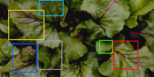
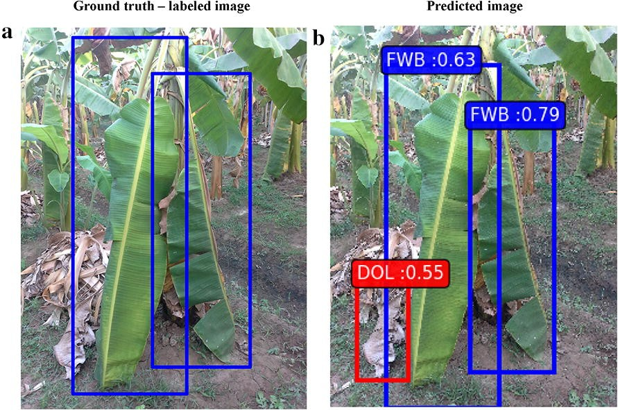

# Proyecto: Platanal. Agente Computacional para Detección de Roya en Café

Proyecto final para la materia de Conceptos Avanzados de Inteligencia Artificial (AY114).

## 📌 Idea Principal

El objetivo de este proyecto es desarrollar un agente computacional en Python (aunque se evaluará si sigue siendo la mejor opción en el futuro) que permita identificar la roya en los arbustos de café de una plantación colombiana. Se entrenará el modelo con técnicas de visión por computador y deep learning o aprendizaje supervisado **(PREGUNTAR EN CLASE)**.

La aplicación inicial será una interfaz gráfica que permita al usuario:

-   Subir una foto de una planta para su análisis.
-   Usar la cámara del dispositivo para realizar detección en tiempo real.

## 🎓 Proyección hacia el Proyecto de Grado de la Maestría

Si el agente funciona correctamente, podría presentarse como proyecto de grado. Si se requiere mayor complejidad, se integrará en un dron autónomo que recorrerá la plantación, generando un mapa de infección para ayudar a los agricultores a tomar decisiones.

**Retos técnicos adicionales:**

-   Implementar vuelo autónomo del dron.
-   Optimizar la duración de la batería para cubrir grandes áreas.
-   Diseñar un sistema de retorno automático a la estación de carga.

## 🚀 Ideas Futuras para Expansión

-   **HIVEMIND:** Red de drones autónomos que trabajan en conjunto para monitorear más rápido la plantación.

    

-   **Extensión a otros cultivos:** Entrenar modelos para detectar enfermedades en bananos y otras plantaciones **(PREGUNTAR EN CLASE SI HAY DIFERENCIA ENTRE MODELOS/AGENTES)**.

    

## 🎯 Posible Comportamiento del Agente

1. El usuario sube una imagen o usa la cámara.
2. El modelo analiza la imagen y detecta la roya.
3. El sistema devuelve:
    - Imagen con las áreas afectadas resaltadas.
    - Un porcentaje estimado de infección.
    - Recomendaciones preventivas y correctivas según el nivel de infección.

_Nota:_ Se debe definir si las recomendaciones se presentan en un documento o directamente en la interfaz.

## 📅 Desarrollo del Proyecto

1. **Definición del problema** 📝
    - Describir el propósito, funcionamiento, limitaciones y mejoras posibles.
2. **Identificación de tecnologías** 🔧
    - Evaluar librerías de visión por computador en Python.
    - Posible migración a otro lenguaje para integración con drones.
3. **Desarrollo del proyecto** 💻
    - Implementación en GitHub para un mejor seguimiento.
4. **Documentación del proyecto** 📄
    - Notion (fase inicial).
    - Overleaf (si se convierte en proyecto de grado).
5. **Pruebas** 🔬
    - Creación de datasets de entrenamiento y prueba.
    - Validación del modelo con imágenes y en tiempo real.
6. **Presentación** 🎤
    - Mejorar la presentación de Notion.
    - Crear diapositivas para mostrar la idea, el código y los resultados.

---
